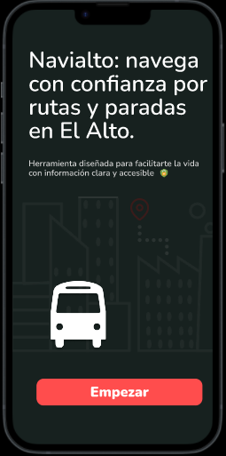

# Mi-Portafolio---Dise-o-UX-UI
Mi espacio para compartir proyectos de diseño UX/UI, herramientas y procesos que utilizo para crear experiencias centradas en las personas.
## Proyectos
1. **[Proyecto 1: Navialto](#)**
   - **Descripción:** Diseño de una app para optimizar la información de rutas y paradas de minibuses en la Ciudad de El Alto - Bolivia..
   - **Metodologías:** Investigación de usuarios, wireframes, prototipos.
   - [Ver el proyecto](https://www.figma.com/design/Dcd2LpGhgL4oInOPYtBizE/NAVIALTO?node-id=0-1&t=Re7iH5exxnoAFxEh-1)
## Tecnologías y Herramientas
- Figma 🎨
- Adobe XD 📱
- Notion para documentación ✍️
## Contacto
📧 Email: gemajancopaola@gmail.com  
🌐 [Mi portafolio](https://tuportafolio.com)

